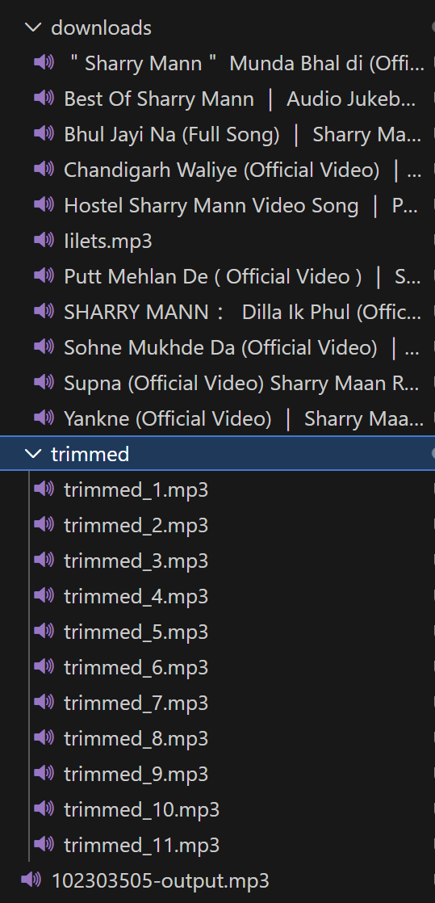
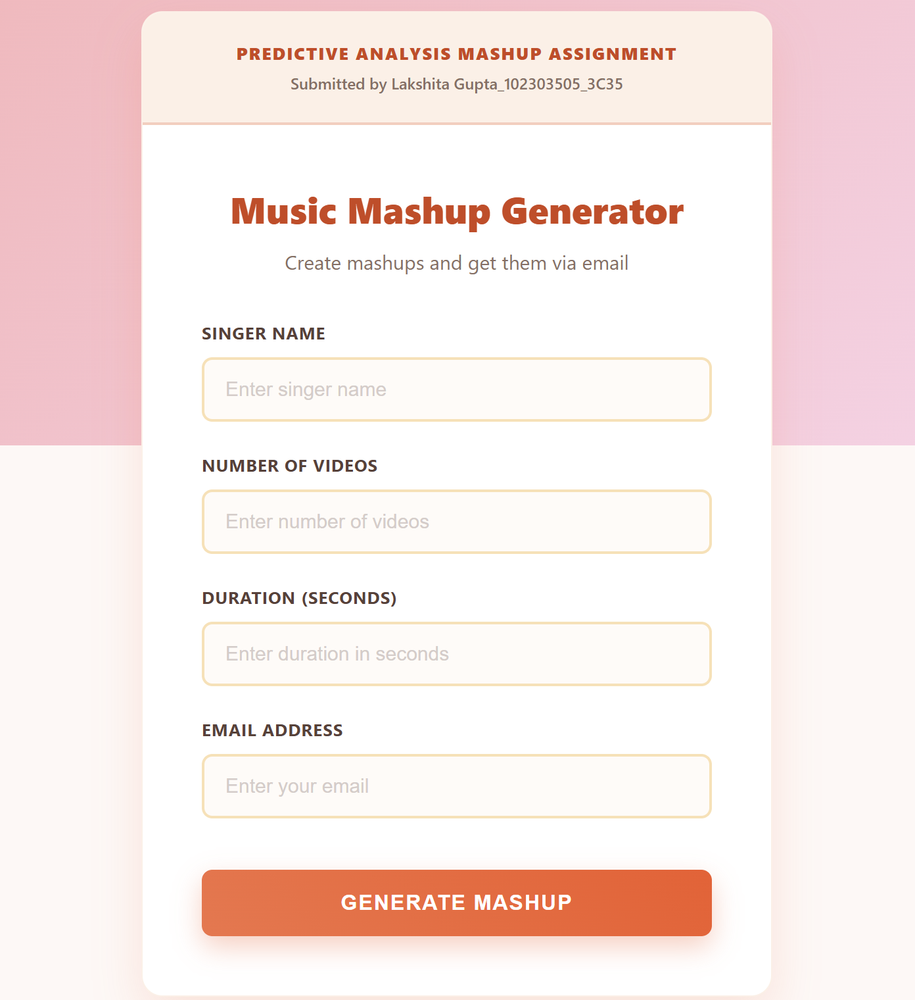

# Mashup Generator

Audio mashup tool that downloads YouTube videos, trims audio clips, and merges them into a single MP3 file.

**This project contains:**
- Program 1 – Command Line Version
- Program 2 – Web Application

---

## Program 1 – Command Line

Generates mashup using terminal.

### Usage
```bash
python 102303505.py <SingerName> <NumberOfVideos> <AudioDuration> <OutputFileName>
```

### Example
```bash
python 102303505.py "Sharry Maan" 20 30 102303505-output.mp3
```

### Sample Output



### Conditions
- NumberOfVideos > 10
- AudioDuration > 20 seconds
- Output file must end with .mp3

### Installation
```bash
pip install yt-dlp pydub ffmpeg-python audioop-lts
pip install ffmpeg-downloader
python -m ffmpeg_downloader install
```

---

## Program 2 – Web Application

Web-based mashup generator with email delivery.

**Live Demo:** [View Application](https://mashup-working.vercel.app/)

### Web Interface



### User Inputs
- Singer Name
- Number of Videos (>10)
- Duration (>20 sec)
- Email ID

**Output is sent as a ZIP file via email.**

---

## Project Structure
```
mashup/
├── program-1/
│   └── 102303505.py
├── program-2/
│   ├── index.html
│   ├── api/
│   ├── requirements.txt
└── README.md
```

---

## Workflow

1. Download YouTube videos
2. Extract audio
3. Trim clips
4. Merge into one MP3
5. Deliver (local save / email)

---

## Author
**Lakshita Gupta**  
Roll No: 102303505